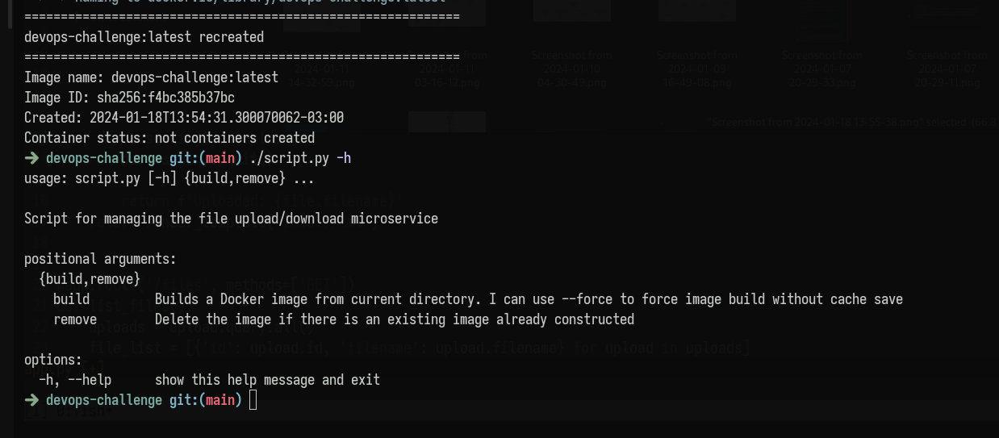

# devops-challenge


Este proyecto contiene un micro servicio hecho en [flask](https://flask.palletsprojects.com/en/3.0.x/), la cual se ayuda de un script en python usando el modulo [Docker SDK](https://docker-py.readthedocs.io/en/stable/). 

## Enunciado
Deberás crear un script en Python que cree una imagen de Docker que
contenga un micro servicio con las siguientes funcionalidades:
- Solicitar un archivo.
- Listar los archivos disponibles.
- Borrar un archivo


## Parametros de uso del script 
``` bash
./script -h, --help              # Argumento para el comando de ayuda
./script build                   # Construye la imagen en caso de que no exista 
./script build --force           # Fuerza la construcción de una imagen ignorando el pre-cache
./script remove                  # Elimina la imagen
```

## Rutas definidas
> Es recomendable el uso de Postman para probar las distintas rutas


``` bash
http://localhost:5555                    # GET, te duvuelve un html donde cargar la imagen 
                                         # POST, te permite cargar un archivo 
http://localhost:5555/files              # GET, lista de archivos definidos en la db
http://localhost:5555/files/<FILE>       # GET, especificando un archivo existente esta ruta te permite descargarlo
http://localhost:5555/file/<FILE>        # DELETE, especificando un archivo existente esta ruta te permite eliminarlo 
```
## Estructura de archivos 
``` bash
.
├── Dockerfile
├── requirements.txt
├── script.py
└── src
    ├── app.py
    ├── __init__.py
    ├── instance
    │   └── db.sqlite3
    └── templates
        └── index.html
```


